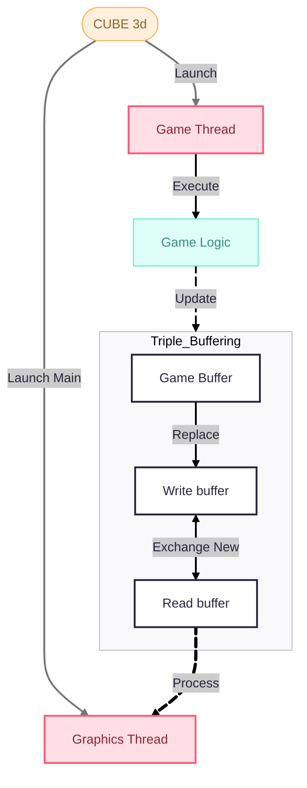

```mermaid
---
config:
  theme: redux
  look: classic
  layout: dagre
---
flowchart TD
 subgraph Triple_Buffering["Triple_Buffering"]
    direction LR
        Buffer1["Game Buffer"]
        Buffer2["Write buffer"]
        Buffer3["Read buffer"]
  end
    n1["CUBE 3d <br>"] -- Launch --> GameThread["Game Thread"]
    n1 -- Launch Main --> GraphicsThread["Graphics Thread"]
    Buffer1 -- Replace --> Buffer2
    Buffer2 <-- Exchange New --> Buffer3
    Buffer3 L_Buffer3_GraphicsThread_0@== Process ==> GraphicsThread
    GameThread -- Execute --> n2["Game Logic <br>"]
    n2 L_n2_Triple_Buffering_0@-- Update --> Triple_Buffering
    n1@{ shape: terminal}
     n1:::Ash
     n1:::Aqua
     n1:::Peach
     GameThread:::Rose
     GraphicsThread:::Rose
     n2:::Aqua
    classDef Rose stroke-width:1px, stroke-dasharray:none, stroke:#FF5978, fill:#FFDFE5, color:#8E2236
    classDef Ash stroke-width:1px, stroke-dasharray:none, stroke:#999999, fill:#EEEEEE, color:#000000
    classDef Aqua stroke-width:1px, stroke-dasharray:none, stroke:#46EDC8, fill:#DEFFF8, color:#378E7A
    classDef Peach stroke-width:1px, stroke-dasharray:none, stroke:#FBB35A, fill:#FFEFDB, color:#8F632D
    style GameThread stroke-width:2px
    style GraphicsThread stroke-width:2px
    linkStyle 0 stroke:#757575,fill:none
    linkStyle 1 stroke:#757575,fill:none
    L_Buffer3_GraphicsThread_0@{ animation: fast } 
    L_n2_Triple_Buffering_0@{ animation: fast }


```
